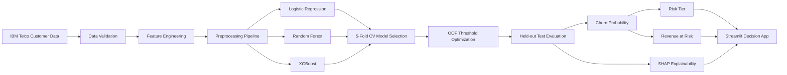

# Customer Churn Intelligence & Retention Prioritization

An end-to-end machine-learning project that predicts customer churn probability, explains the drivers behind each prediction, and converts model output into a prioritized retention queue using customer value.

The project uses the **IBM Telco Customer Churn** sample (7,043 customers, 21 source columns) and is designed as a portfolio-ready Data Science application rather than a notebook-only classifier.

## What this project solves

A churn model is useful only when a retention team can act on it. This system answers four questions:

1. **Who is likely to churn?** — predicted churn probability.
2. **How urgent is the risk?** — Low, Medium, High, and Critical tiers.
3. **Why is the customer at risk?** — local SHAP-based explanation.
4. **Who should be contacted first?** — retention priority based on modeled revenue at risk.

## Key capabilities

- Leakage-safe sklearn pipeline for preprocessing + feature engineering + classification.
- 80/20 stratified train/test split.
- 5-fold cross-validation across **Logistic Regression, Random Forest, and XGBoost**.
- Model selection using cross-validated ROC-AUC.
- Operating threshold selected from out-of-fold training predictions using **F2 score** to emphasize churn recall.
- Metrics: Accuracy, Precision, Recall, F1, F2, ROC-AUC, PR-AUC, confusion matrix.
- Business features including service count, new-customer flag, automatic-payment flag, tenure band, and average monthly spend.
- Individual customer scoring with churn probability and risk tier.
- Batch CSV scoring with downloadable prioritized retention list.
- **Revenue at Risk = Churn Probability × Monthly Charges × 12** for prioritization.
- SHAP/local explanations plus global feature importance.
- Four-tab Streamlit application: Executive Dashboard, Customer Predictor, Batch Scoring, Model Insights.
- Unit tests, GitHub Actions CI, and Docker support.

> **Important:** Revenue at risk is a modeled prioritization measure, not a claim of realized financial loss or campaign uplift.

## Architecture



## Repository structure

```text
customer-churn-intelligence/
├── app.py
├── requirements.txt
├── Dockerfile
├── MODEL_CARD.md
├── sample_customer.csv
├── data/
│   ├── raw/
│   └── processed/
├── models/
├── notebooks/
│   └── 01_end_to_end_churn_analysis.ipynb
├── src/
│   ├── data.py
│   ├── features.py
│   ├── modeling.py
│   └── train.py
├── tests/
│   └── test_features.py
└── .github/workflows/ci.yml
```

## Dataset

The project uses the IBM Watson Analytics Telco Customer Churn sample. Each row represents one customer and includes demographic, service, contract, billing, and churn information.

The raw dataset is downloaded on first run to:

```text
data/raw/telco_customer_churn.csv
```

Expected profile:

- Customers: **7,043**
- Source columns: **21** including `customerID` and target `Churn`
- Historical churn share: approximately **26.5%**
- Target: `Churn` (`Yes` / `No`)

Public mirror used by the downloader:
`https://github.com/SaeidRostami/Customer_Churn`

## Feature engineering

The sklearn pipeline generates the following business-oriented features during both training and inference:

| Feature | Definition |
|---|---|
| `TotalServices` | Count of active telecom/support/streaming services |
| `AvgMonthlySpend` | TotalCharges / tenure |
| `NewCustomer` | 1 when tenure is 6 months or less |
| `HighMonthlyCharges` | Above the median monthly charge learned from training data |
| `AutomaticPayment` | 1 for bank transfer / credit card automatic payment |
| `TenureGroup` | 0-6, 7-12, 13-24, 25-48, 49+ months |

Categorical variables are imputed and one-hot encoded. Numeric variables are median-imputed and standardized. The transformation is bundled with the estimator so the application uses the same preprocessing logic as training.

## Modeling strategy

Three models are benchmarked:

- **Logistic Regression** — interpretable linear baseline.
- **Random Forest** — nonlinear bagging model with balanced class weights.
- **XGBoost** — boosted-tree benchmark for tabular classification.

Training workflow:

```text
Raw data
  ↓
80/20 stratified split
  ↓
5-fold CV on training set
  ↓
Select highest mean CV ROC-AUC
  ↓
Generate out-of-fold probabilities
  ↓
Choose threshold maximizing F2
  ↓
Fit selected model on full training set
  ↓
Evaluate exactly once on held-out test set
```

The classification threshold is not tuned on the held-out test set, which prevents test-set information from leaking into the decision rule.

## Run locally

### 1. Clone

```bash
git clone https://github.com/prashant-kumar-h20260818/customer-churn-intelligence.git
cd customer-churn-intelligence
```

### 2. Create an environment

```bash
python -m venv .venv
```

Windows:

```bash
.venv\Scripts\activate
```

macOS/Linux:

```bash
source .venv/bin/activate
```

### 3. Install dependencies

```bash
pip install -r requirements.txt
```

### 4. Download data + train

```bash
python -m src.train
```

This generates:

```text
models/churn_pipeline.joblib
models/model_metrics.json
data/processed/scored_customers.csv
data/processed/feature_importance.csv
```

### 5. Launch Streamlit

```bash
streamlit run app.py
```

The Streamlit app can also train the project automatically on first launch when model artifacts are absent.

## Streamlit application

### Executive Dashboard

Shows customer count, historical churn rate, High/Critical risk population, modeled annual revenue at risk, and churn patterns across contract, internet service, tenure, and payment method.

### Customer Predictor

Enter one customer profile and receive:

- Churn probability
- Risk tier
- Annual customer value
- Modeled revenue at risk
- Selected decision threshold
- Top local churn drivers

### Batch Scoring

Upload a customer CSV and receive a ranked output containing:

- `ChurnProbability`
- `RiskTier`
- `AnnualCustomerValue`
- `RevenueAtRisk`
- `RetentionPriority`

The full ranked retention list can be downloaded from the app.

### Model Insights

Displays:

- Model comparison
- Held-out ROC-AUC / PR-AUC
- Recall / precision / F1 / accuracy
- ROC curve
- Precision-recall curve
- Confusion matrix
- Global feature importance

## Why this project uses more than accuracy

Churn is an imbalanced business problem. A model can obtain reasonable accuracy by favoring the majority class. The project therefore evaluates both ranking quality and the retention decision boundary using:

- **ROC-AUC** — class-ranking performance.
- **PR-AUC** — useful for evaluating the churn class.
- **Recall** — fraction of actual churners captured.
- **Precision** — fraction of flagged customers who actually churn.
- **F1** — balanced precision/recall measure.
- **F2** — gives recall more weight when selecting the operating threshold.

## Training metrics

Run:

```bash
python -m src.train
```

Exact metrics are written to `models/model_metrics.json`. Keeping performance generated from the actual training run prevents unsupported or fabricated resume claims.

## Tests

```bash
python -m pytest -q
```

GitHub Actions runs the test suite automatically on pushes and pull requests to `main`.

## Docker

```bash
docker build -t customer-churn-intelligence .
docker run -p 8501:8501 customer-churn-intelligence
```

Then open `http://localhost:8501`.

## Deploy to Streamlit Community Cloud

1. Open Streamlit Community Cloud.
2. Select this GitHub repository and the `main` branch.
3. Set the entry point to `app.py`.
4. Deploy.

No API key or secret is required for the sample dataset.

## Resume-ready project description

**Customer Churn Intelligence & Retention Prioritization System | Python, Scikit-learn, XGBoost, SHAP, Streamlit**

- Built an end-to-end customer churn intelligence system on **7,043 customers and 20+ demographic, service, contract, and billing attributes**, implementing leakage-safe feature engineering and benchmarking Logistic Regression, Random Forest, and XGBoost using cross-validated ROC-AUC.
- Engineered a **Streamlit ML application** for real-time and batch churn scoring with **4-tier risk segmentation**, threshold optimization, and SHAP-based churn-driver explanations to support targeted retention decisions.
- Developed a value-based retention framework combining churn probability with annual customer value to quantify **modeled revenue at risk** and generate downloadable customer-priority lists for proactive retention workflows.

After running the full IBM dataset, add the actual ROC-AUC, recall, F1, selected model, and threshold values from `models/model_metrics.json` to your final resume version.

## Limitations

- This is a historical classification dataset, not a time-aware churn panel.
- There is no treatment/control experiment, so the project cannot claim that a retention action caused an uplift.
- Revenue-at-risk does not include gross margin, intervention cost, save rate, or customer lifetime-value uncertainty.
- Risk tiers are communication bands rather than thresholds optimized from a real operational cost matrix.
- The sample is appropriate for demonstrating the ML workflow but should not be treated as a production telecom population.

## Next production improvements

- Probability calibration and calibration monitoring.
- Uplift modeling using treatment/control retention data.
- Cost-sensitive threshold optimization based on intervention cost and expected save value.
- Feature/data drift monitoring and model-version metadata.
- Prediction API and persisted scoring history.
- Experiment tracking with MLflow or an equivalent platform.

## License

MIT License for the project code. Dataset rights remain with the original data provider/source.
